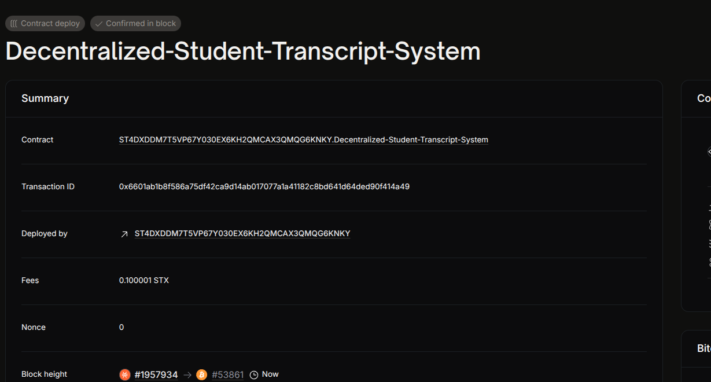

# Decentralized Student Transcript System

## Project Description

This smart contract implements a **blockchain-based system** for issuing and verifying student transcripts. It ensures that **only authorized educational institutions** (issuers) can create transcript records for students, which are **securely stored on-chain** using cryptographic hashes (e.g., IPFS hashes).

By leveraging the transparency and immutability of blockchain, this system eliminates the possibility of transcript forgery and allows **third parties (employers, institutions)** to verify academic records in a trustless manner.

---

## Key Features

- ✅ **Authorized Issuer Only**  
  Only the contract deployer (defined as the `issuer`) can create transcript entries.

- 📦 **Transcript Storage**  
  Transcripts are not stored directly on-chain but represented by a 32-byte hash (e.g., IPFS CID) mapped to each student’s wallet address (`principal`).

- 🔒 **Tamper-Proof Records**  
  Once issued, transcript records are immutable — they cannot be changed or overwritten in the current version of the contract.

- 🔍 **On-Chain Verification**  
  Anyone can retrieve the hash of a transcript by querying the student’s principal. This hash can be verified against an off-chain document (e.g., stored in IPFS).

---

## Error Codes

| Error Constant           | Code   | Description                                           |
|--------------------------|--------|-------------------------------------------------------|
| `err-not-issuer`         | `100`  | Function caller is not the authorized transcript issuer |
| `err-transcript-exists`  | `101`  | Transcript already exists for this student             |
| `err-transcript-not-found` | `102` | Transcript record does not exist for the given student |

---

## Project Vision

To create a transparent, tamper-proof, and easily accessible student transcript system that eliminates forgery and simplifies verification for employers, institutions, and students worldwide. This solution builds trust across the global academic ecosystem and supports the digitization of academic credentials.

---

## Future Scope

This version establishes a secure foundation for transcript issuance. Future enhancements include:

### 🔄 Transcript Updates & Reissuance
- Allow authorized issuers to **update or revoke** transcripts with traceable versioning.
- Enable re-issuance in cases of corrections or degree upgrades.

### 🏫 Multi-Issuer Support
- Add support for **multiple authorized institutions** to issue transcripts under the same system.
- Introduce role-based access control or admin-governed registration of issuers.

### 🌐 Decentralized Storage Integration
- Use **IPFS, Arweave, or Filecoin** to store actual transcript documents.
- Keep only hashes or CIDs on-chain for lightweight and cost-effective operation.

### 📱 User-Friendly Interfaces
- Build a web/mobile portal for:
  - Students to request, download, or share transcripts.
  - Employers/institutions to verify credentials using the hash.
- Add QR code generation and scanning for quick verification.

---

## Technical Stack

- **Smart Contract Language**: Clarity
- **Blockchain**: Stacks (secured by Bitcoin)
- **Design Pattern**: Single-authority issuance with decentralized verification

---

## How It Works

1. **Issuance**  
   - The contract owner (issuer) calls `issue-transcript`, passing the student's principal and the transcript hash.
   - The hash is saved to the blockchain, associated with the student's address.

2. **Verification**  
   - Anyone can call `get-transcript` with a student's principal to fetch their transcript hash.
   - The hash can be compared against a local or IPFS-stored transcript to ensure integrity.

---

## Smart Contract Functions

### Public Functions

- `issue-transcript (student principal) (transcript-hash buff32)`  
  Issues a transcript hash for a student. Only callable by the issuer.

### Read-Only Functions

- `get-transcript (student principal)`  
  Returns the transcript hash for a student, or `none` if not found.

---

## Deployment Notes

- Use [Clarinet](https://docs.hiro.so/stacks/clarinet) to test and deploy the contract.
- The issuer is set at contract deployment as `tx-sender`. Consider upgrading to support dynamic issuer management in future versions.

---

Let us know if you'd like help setting up a front-end or integrating with IPFS for a complete system.

## Contract Address
ST4DXDDM7T5VP67Y030EX6KH2QMCAX3QMQG6KNKY.Decentralized-Student-Transcript-System

